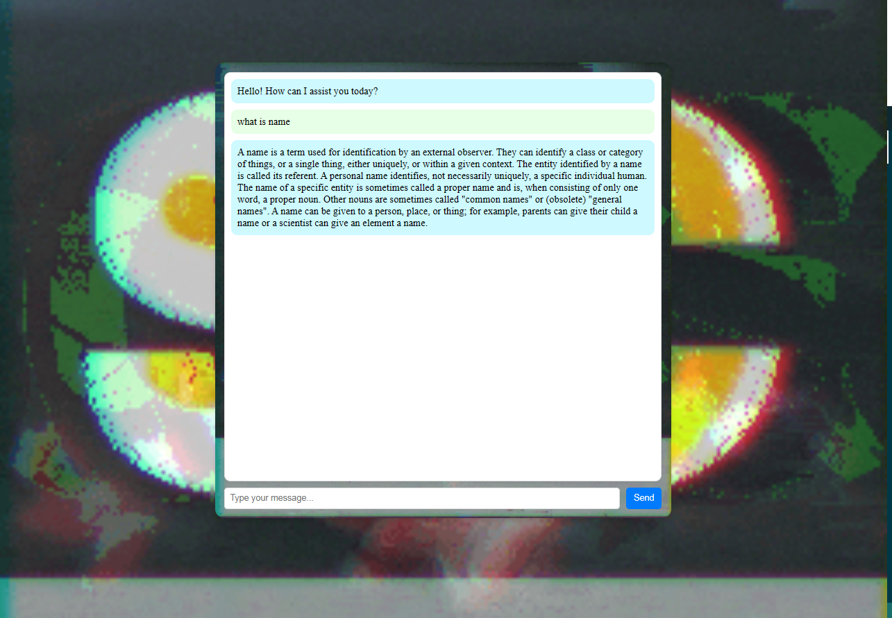

# Chat Application

This is a simple chat application built using HTML, CSS, and JavaScript. It allows users to send messages and receive responses from a bot.

## Table of Contents

- [Features](#features)
- [Installation](#installation)
- [Usage](#usage)
- [Demo](#demo)
- [Screenshots](#screenshots)
- [Contributing](#contributing)
- [License](#license)

## Features

- User-friendly interface
- Send messages and receive responses
- Bot replies based on user input
- Responsive design for various screen sizes

## Installation

1. Clone the repository:
    ```bash
    git clone https://github.com/gmpsankalpa/chat-bot.git

2. Navigate to the project directory:

   ```bash
   cd chat-bot

3. Open the `index.html` file in your web browser.

## Usage

1. Type a message in the input box at the bottom of the chat interface.
2. Press the "Send" button or hit Enter to send the message.
3. The bot will process the message and respond accordingly.
4. Messages are displayed in the chat area, with user messages aligned to the right and bot messages aligned to the left.

## Demo

You can view a live demo of the chat application [here](https://gmpsankalpa.github.io/Chat-Bot/).

## Screenshots



## Contributing

Contributions are welcome! If you have any improvements or features you'd like to add, please follow these steps:

1. Fork the repository.
2. Create a new branch for your feature: `git checkout -b feature-name`
3. Commit your changes: `git commit -m 'Add some feature'`
4. Push to the branch: `git push origin feature-name`
5. Submit a pull request.

## License

This project is licensed under the [MIT](LICENSE) License.

---

<div align="center">

   
   
   
   

</div>
